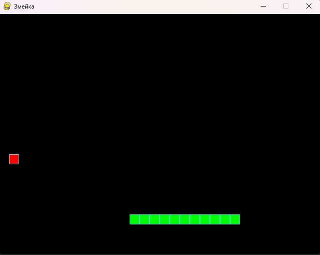
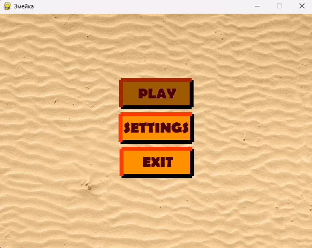
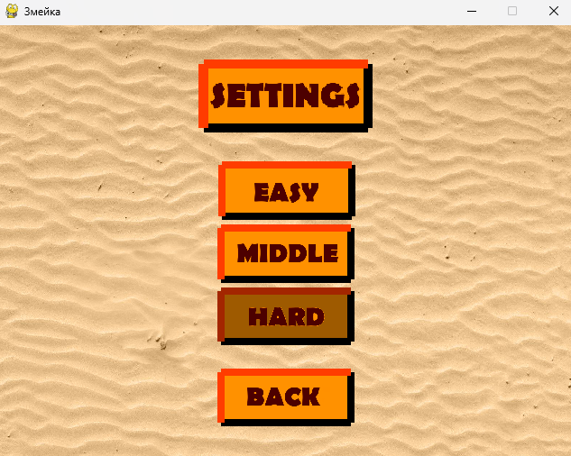
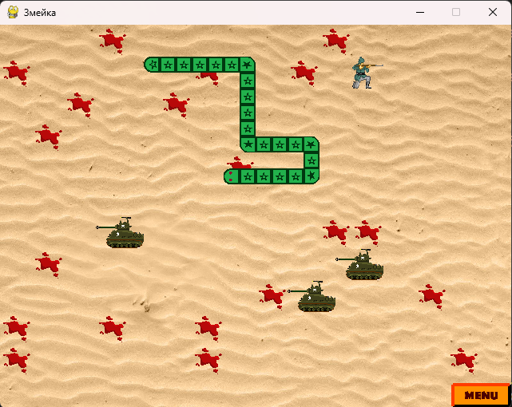
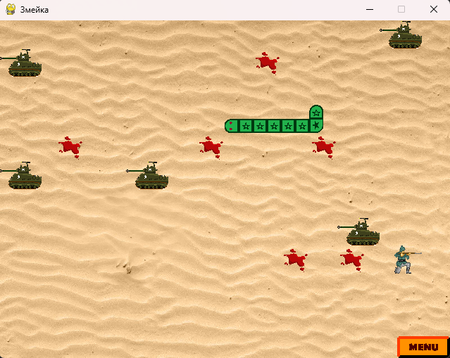
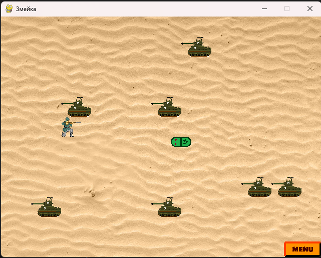

# Проект: Змейка

Этот проект представляет собой две версии игры "Змейка", реализованной на Python с использованием библиотеки Pygame.

## Основные ветки проекта

### 1. Ветка `main`
Ветка `main` содержит стандартную версию игры "Змейка", которая была написана на курсе Yandex и представляет собой классическую весрию игры. В этой версии игрок управляет змейкой, которая двигается по игровому полю и собирает яблоки.

- **Особенности стандартной версии:**
  - Змейка управляется с помощью стрелок на клавиатуре.
  - Цель игры — собрать как можно больше яблок, увеличивая длину змейки.
  - Игра заканчивается при столкновении с границей экрана или собственной змейкой.



### 2. Ветка `version-2.0`
Ветка `version-2.0` содержит модернизированную версию игры с авторскими дополнениями. В этой версии вместо яблока используется солдатик, а в качестве преград добавлены танки.

- **Особенности версии 2.0:**
  - **Солдатик** вместо яблока — основной объект, который нужно "собирать", чтобы увеличивать длину змейки.
  - **Танки** выступают в роли препятствий на игровом поле. Если змейка столкнется с танком — игра заканчивается.
  - Добвлены главное меню и меню настроек сложности игры.
  - Улучшенное взаимодействие объектов.
  - Добавлен эффект следа крови при съедании солдатика.

<div style="display: flex; flex-direction: row; gap: 2px; margin: 0; padding: 0;">
  
  
</div>

<div style="display: flex; flex-direction: row; gap: 2px; margin: 0; padding: 0;">
  
  
  
</div>

## Как переключаться между версиями

Чтобы переключиться между стандартной версией и модернизированной:
1. Открой терминал в корневой папке проекта.
2. Используй команду `git checkout`, чтобы выбрать нужную ветку:
   - Для стандартной версии (из курса Yandex):
     ```bash
     git checkout main
     ```
   - Для версии с солдатиком и танками:
     ```bash
     git checkout version-2.0
     ```

# Описание ветки `version-2.0`

Этот проект представляет собой реализацию игры "Змейка", где игрок управляет змейкой, которая перемещается по экрану,
поедает солдатиков и с каждым солдатиком увеличивается в длину. Игра завершается, когда змейка сталкивается с собственной частью тела
или с танками.

## Основные компоненты проекта:

- **GameObject** — базовый класс для всех объектов игры.
- **Snake** — дочерний класс, управляющий змейкой и её движением.
- **Soldier** — дочерний класс для управления солдатиком, который появляется на поле.
- **Tank** — дочерний класс для управления танками, которые появляется на поле.
- **Главное меню** — экран с возможностью начать игру, изменить настройки или выйти.
- **Меню настроек** — экран с настройками сложности (easy, middle, hard) игры. Каждый тип сложности влияет на скорость змейки и количество препятствий(танков).

## Особенности

- Отрисовка и управление объектами происходит с помощью библиотеки **Pygame**.
- В проекте реализована система обработки столкновений.
- Есть возможность изменения настроек игры.
- Интерактивное главное меню с различными пунктами.

## Структура проекта:

```bash
.
├── img/                    # Изображения, используемые в игре (фон, элементы меню)
│   ├── but/                # Папка с изображениями кнопок для меню
├── objects/                # Пакет с модулями классов объектов игры (змейка, меню и т.д.)
├── main.py                 # Точка входа в программу (главное меню)
├── main_function_game.py   # Основные функции игры (управление событиями)
├── main_game_snake.py      # Основной игровой цикл
├── settings.py             # Настройки игры (размеры экрана, скорость и т.д.)
├── settings_menu.py        # Логика меню настроек
├── requirements.txt        # Зависимости проекта
├── README.md               # Описание проекта
```

## Установка и запуск

### 1. Клонирование репозитория

```bash
git clone https://github.com/Evgenii1021/the_snake.git
cd the_snake
```

### 2. Создание виртуального окружения
   Для создания виртуального окружения и установки зависимостей:

```bash
python3 -m venv venv
source venv/bin/activate
pip install -r requirements.txt
```

### 3. Запуск игры
   После установки всех зависимостей, запустите игру:

```bash
python3 main.py
```

## Как играть
- Запустите игру.
- Используйте стрелки на клавиатуре для управления змейкой.
- Съедайте солдатиков, чтобы увеличивать длину змейки.
- Избегайте столкновения c собственной змейкой и танками.
- Настройте параметры игры в меню настроек.


## Зависимости
- Python 3.8+
- Pygame 2.5.2+
- Все зависимости указаны в requirements.txt.

## Лицензия
Этот проект распространяется под лицензией MIT.

Полный текст лицензии доступен в файле [LICENSE.txt](./LICENSE.txt).
